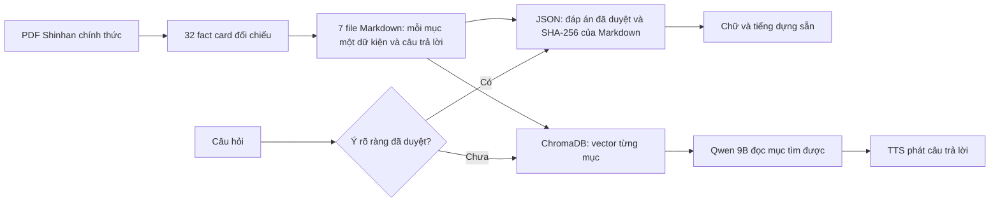

# Kho tri thức Shinhan và câu đệm: kết quả chạy trên Windows

Ngày 24/09/2026. Backend Windows, RTX 5070 11,9 GB, Qwen3.5 9B qua Ollama,
BGE-M3 trên CPU, ChromaDB và F5-TTS. Training đã dừng; các phép đo dưới đây
chạy trên dịch vụ thật qua WebSocket, không dùng model giả.

## Cách dữ liệu đi qua hệ thống

7 file Markdown có URL và SHA-256 của PDF nguồn. Một mục `##` đi vào một mảnh
vector, giữ tên tài liệu và tên dữ kiện. Khi file MD đổi, chỉ mục JSON không còn
khớp SHA-256 thì đường trả lời tức thì tự ngừng dùng đáp án cũ. ChromaDB hiện
có **61 mảnh từ 12 file** trên máy Windows; đây là chỉ mục vector, không phải
quét lần lượt file MD mỗi lượt hỏi. File Markdown Shinhan được lọc theo ngân
hàng trước khi xếp hạng; câu hỏi thẻ điện tử còn lọc đúng mục thẻ điện tử để
không lấy nhầm thẻ vật lý. PDF archive và bảng phí/lãi suất chưa được duyệt
không nằm trong bộ 32 fact card.

## Tốc độ và độ đúng đã quan sát

`scripts/benchmark_shinhan_fast_ws.py` hỏi 6 ý đã duyệt qua WebSocket
`text_soi`: kích hoạt thẻ, khóa thẻ mất, đăng ký thẻ điện tử, trạng thái cá
nhân chưa có dữ liệu, kích hoạt thẻ điện tử, và câu ghép đăng ký + kích hoạt.
Trung vị **2,5–3,0 ms** qua hai lần đo để backend trả chữ; riêng câu ghép
**2,6–3,2 ms**. Cả 6 lượt
không gọi RAG hoặc Qwen. Với WebSocket `text`, chữ và toàn bộ byte âm thanh
đã dựng sẵn đến client sau khoảng **18–27 ms**. Đây là thời gian *gửi dữ liệu*
từ lúc backend nhận câu chữ, không phải thời gian khách nghe hết âm thanh hay
thời gian nhận dạng giọng nói.

`scripts/probe_shinhan_fallback_ws.py` thử câu ghép ngoài bộ đáp án sẵn:
“Đăng ký thẻ điện tử Shinhan trên SOL cần làm những bước nào và mã SMS dùng ở
đâu?”. RAG lấy đúng hai mục đăng ký/kích hoạt, tìm mất **184–212 ms** trong các
lượt đo. Qwen trả chữ qua `text_soi` sau khoảng **1,08–1,37 giây** cho cả lượt;
câu trả lời gồm cả đăng ký trên SOL và mã SMS dùng để kích hoạt. Lượt sau cùng
đo RAG **247 ms** vì có phép đo khác chạy đồng thời. Khi phát giọng,
câu đệm phù hợp “Dạ phần thẻ điện tử anh chị hỏi,” được gửi sau **184 ms**, dài
**1,63 giây**; mảnh tiếng trả lời thật đầu tiên đến sau **1,50 giây**, cả lượt
gửi xong sau **2,47 giây**. Tiếng thật nối sau câu đệm và không lặp “Dạ”.

Trước khi sửa, cùng câu hỏi có điểm chọn tình huống 0,855 nhưng rơi về câu
đệm chung vì ngưỡng 0,90. Nay câu đầy đủ có cụm “thẻ điện tử” xác nhận ứng
viên vector đứng đầu nên lấy câu đệm đúng chủ đề. Phiên âm dở vẫn giữ ngưỡng
chặt để tránh chọn sai tình huống. Trước khi sửa cách nối, Qwen đôi lúc nói
“không có thông tin” dù hai mảnh tài liệu đã ở prompt. Luồng Shinhan có RAG
nay để Qwen đọc nguồn với lượt trả lời riêng; bộ lọc lời bỏ lời chào lặp khi
phát sau câu đệm.

Một ca phản ví dụ quan trọng: “Thẻ điện tử khác thẻ vật lý và có mất phí
không?” Bộ Markdown hiện không có căn cứ cho so sánh hay phí, và Qwen từng tự
suy ra thẻ điện tử dùng như thẻ vật lý. Ca này cùng các biến thể hỏi riêng phí
hoặc so sánh được trả bằng đáp án an toàn có SHA-256, nêu rõ phần tài liệu có
và phần chưa thể xác nhận. Không coi lời suy đoán của 9B là dữ kiện ngân hàng.

## Cập nhật tốc độ chọn câu đệm

Với câu chữ đầy đủ có cụm rõ “thẻ điện tử”, bộ chọn giờ xác nhận bằng từ khóa
trước và bỏ qua phép nhúng BGE-M3. Những câu mơ hồ hoặc có từ khóa xung đột
vẫn đi qua vector; câu phủ định như “không hỏi thẻ điện tử” không được chọn
nhanh. Giao diện **Câu đệm → Thử** hiển thị cách chọn để kiểm tra.

Trên Windows/GPU, cùng câu hỏi đăng ký thẻ điện tử ở trên, tiếng câu đệm đầu
tiên đến qua WebSocket sau **4,1 / 4,0 / 4,4 ms** trong ba lượt lặp; thời gian
riêng của bộ chọn là **0,31 ms** mỗi lượt. Trước tối ưu, phép chọn vector làm
tiếng câu đệm đầu đến sau khoảng **187 ms**. Cả ba lượt mới đều chọn đúng
`the_dien_tu` và trả lời đúng hai ý SOL + mã SMS. Đây là mốc nhận byte tiếng
đầu từ câu *chữ đầy đủ* sau khi gửi vào backend, không phải thời gian phát
hết câu đệm, cũng chưa gồm STT khi khách nói bằng giọng. Bài kiểm thử Windows
cho API/tình huống/ghép câu đệm đạt **82 passed**; thử trên giao diện thật cho
kết quả “từ khóa rõ · chọn ngay” và không có lỗi JavaScript.

Sau đó bộ chọn nhanh được mở cho **mọi câu ví dụ đã lưu** trong kho câu đệm:
thêm/sửa ví dụ trên giao diện sẽ nạp lại kho và nhúng đúng tình huống vừa đổi.
Câu khách trùng một ví dụ duy nhất được chọn không cần nhúng câu hỏi; cách
diễn đạt mới vẫn được vector chấm. Nếu cùng một ví dụ thuộc hai tình huống
đang bật, hệ thống không đoán: trang Thử báo trùng để sửa dữ liệu. Trên
Windows, 85 bài kiểm thử API/tình huống/ghép câu đệm đạt; giao diện thật đã
hiển thị cả “ví dụ đã lưu · chọn ngay” và cảnh báo ví dụ trùng. Đây là dữ
liệu *tình huống câu đệm*, không phải tự tạo câu đệm từ file MD tri thức.

### Câu chê ngắn theo ngữ cảnh phiên

Ca hai lượt “AI báo lãi → khách nói *Cao thế em*” đã tái hiện trên WebSocket
Windows: trước sửa, câu đệm rơi về nhóm chung dù Qwen trả lời về lãi. Nay bộ
chọn đọc **lời AI ngay trước đó** trong cùng phiên; nếu lời đó thực sự báo lãi
và khách chê bằng câu ngắn, chọn `che_lai_cao`. Nếu AI vừa chuyển sang phí,
không mượn chủ đề lãi cũ. Với tiếng ngắn, STT được lấy trước câu đệm và dùng
lại cho câu trả lời, vì chọn sau khi đã phát thì khách vẫn nghe câu đệm sai.

Đã thử cả câu gõ và tiếng sinh thử đi theo luồng `audio_chunk → audio_end`:
STT nhận “cao thế em”, câu đệm đúng chủ đề, câu trả lời nối tiếp hợp ý. Một
lượt đo trên Windows có STT trước câu đệm **18–19 ms**, byte tiếng đầu đến sau
`audio_end` **21,9–24,5 ms**. Thời gian thực tế tùy tiếng khách và kênh thoại. Bộ
kiểm thử Windows liên quan đạt **137 passed**. Trang Câu đệm có phần thử
cùng câu khách hỏi trước và lời AI vừa nói; nhập ca này chọn ngay tình huống
chê lãi, còn bỏ ngữ cảnh thì không gán nhầm. Hai câu mẫu cũ tự nhận “tốp
thị trường” về lãi/hạn mức đã được thay trong bảng hỏi-đáp và tài liệu mẫu;
không khẳng định thứ hạng khi không có căn cứ.

## Phạm vi đo

Các số trên là vài câu mẫu trên kho 61 mảnh, chưa phải benchmark hàng nghìn
tài liệu, tải đồng thời nhiều phiên, hoặc cuộc gọi đầy đủ STT → trả lời → TTS.
Khi thêm nhiều MD, thời gian nhập vector phát sinh lúc lập chỉ mục; thời gian
hỏi thông thường phụ thuộc nhúng câu hỏi và tìm trong ChromaDB. 9B vẫn có thể
sai ở câu ngoài bộ dữ kiện đã duyệt; cần thêm dữ kiện và ca kiểm thử cho từng
nghiệp vụ trước khi dùng như lời tư vấn ngân hàng chắc chắn.
