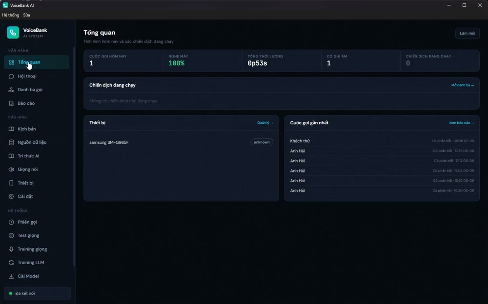
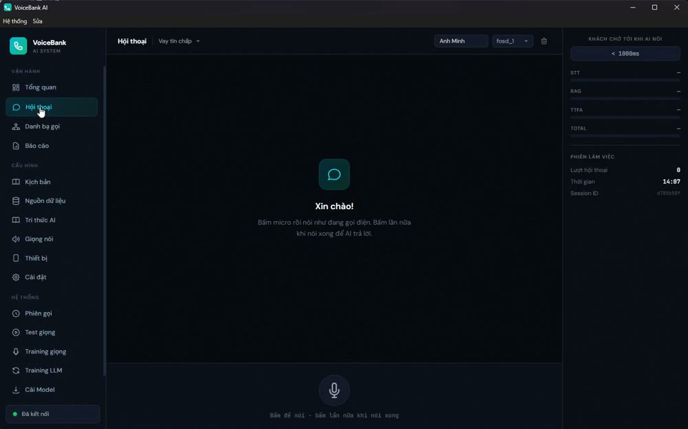
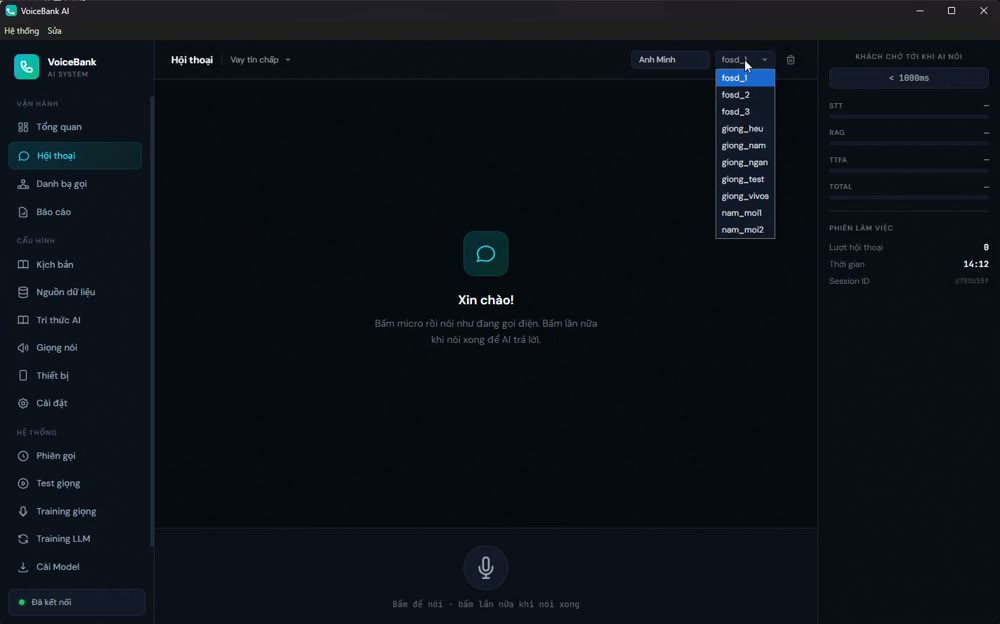
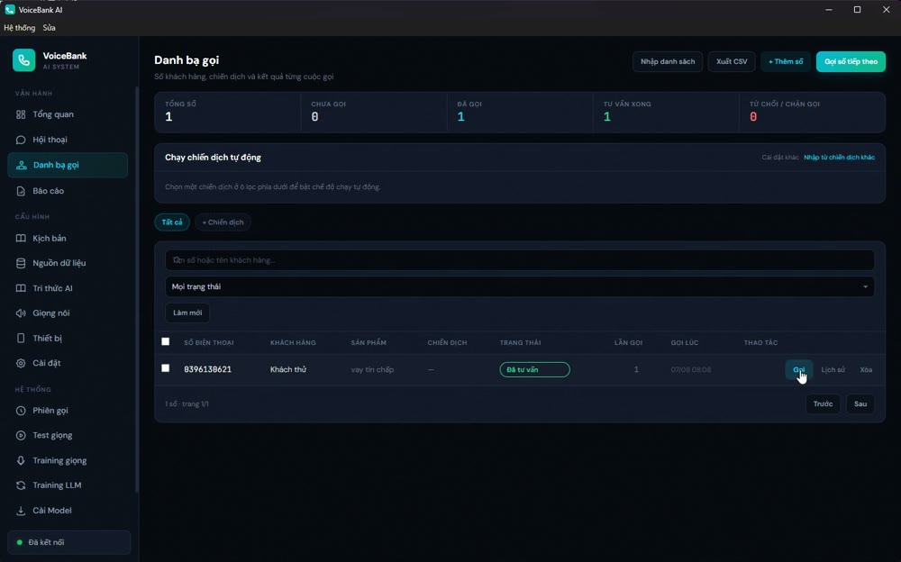
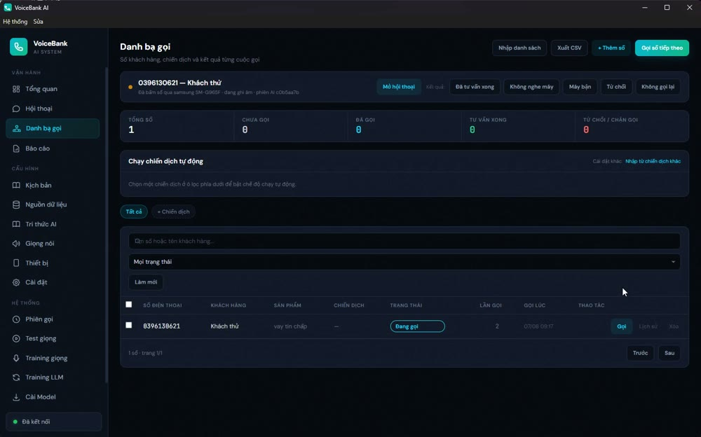

# Chọn giọng và gọi cho khách

Hướng dẫn thao tác trên app **VoiceBank AI**: chọn giọng đọc rồi gọi ra cho một số
trong danh bạ. Ảnh chụp từ chính buổi quay video `huong_dan_goi_khach.mp4` — cuộc gọi
thật tới số 0396130621, ngày 07/08/2026.

> **Điều dễ nhầm nhất:** ô chọn giọng nằm ở màn **Hội thoại**, nhưng nút **Gọi** lại ở
> màn **Danh bạ gọi**. Nút Gọi lấy đúng giọng đang chọn bên Hội thoại, nên **phải chọn
> giọng trước, rồi mới sang danh bạ bấm Gọi**. Chọn sau khi đã bấm Gọi thì không kịp.

---

## Trước khi bắt đầu

Góc dưới bên trái phải hiện chấm xanh **"Đã kết nối"**. Nếu chưa, đợi dịch vụ nạp xong
(lần khởi động đầu mất 2–3 phút để nạp giọng nói); trong lúc đó app vẫn mở được nhưng
gọi sẽ không ra tiếng.

Máy điện thoại phải hiện trong màn **Thiết bị** và đang cắm cáp USB.

---

## Bước 1 — Xem màn Tổng quan

Mở app, màn đầu tiên là **Tổng quan**: số cuộc gọi hôm nay, tỉ lệ nghe máy, tổng thời
lượng, thiết bị đang có và các cuộc gọi gần nhất.

---

## Bước 2 — Vào màn Hội thoại

Bấm **Hội thoại** ở cột trái. Ô chọn giọng nằm ở **góc trên bên phải**, ngay cạnh ô tên
khách hàng.

---

## Bước 3 — Mở danh sách giọng

Bấm vào ô chọn giọng để xổ danh sách các giọng đã có trong máy.

Muốn nghe thử từng giọng trước khi chọn thì vào **Giọng nói** ở cột trái — ở đó mỗi
giọng có nút phát và thanh chỉnh tốc độ đọc.

---

## Bước 4 — Chọn giọng

Bấm vào giọng muốn dùng. Ví dụ trong ảnh chọn `giong_heu`. Ô chọn sẽ hiện tên giọng vừa
chọn.

---

## Bước 5 — Sang màn Danh bạ gọi

Bấm **Danh bạ gọi** ở cột trái. Màn này liệt kê số khách hàng kèm trạng thái, số lần đã
gọi và thời điểm gọi gần nhất.

---

## Bước 6 — Bấm Gọi

Ở dòng số khách cần gọi, bấm nút **Gọi** trong cột **THAO TÁC**.

---

## Bước 7 — AI tự chào và tư vấn

Máy quay số. Khi khách bắt máy, AI **tự đọc câu chào** rồi nghe khách nói và trả lời —
không cần ai bấm gì thêm. Thanh trạng thái phía trên hiện số đang gọi, máy đang dùng,
mã phiên và các nút kết quả (**Đã tư vấn xong**, **Không nghe máy**, **Máy bận**,
**Từ chối**, **Không gọi lại**).

Giọng dùng cho cuộc gọi này chính là giọng đã chọn ở Bước 4.

Cuộc gọi thật trong video chạy đúng như vậy:

| | |
|---|---|
| AI chào | *"Dạ em chào anh/chị, em là Lan bên Ngân hàng ABC ạ."* |
| Khách | *"Ơ sao em biết cả anh"* |
| AI | *"Dạ anh đang quan tâm đến sản phẩm vay tín chấp của bên em..."* |
| Khách | *"Anh muốn vay năm mươi triệu"* |
| AI | *"Hiện anh có thể vay tối đa lên đến 500 triệu đồng với hạn mức này..."* |

---

## Sau cuộc gọi

- Bấm một trong các nút kết quả trên thanh trạng thái để chốt trạng thái số đó.
- Bản ghi âm và nội dung hội thoại xem ở **Báo cáo** hoặc **Phiên gọi**.
- Ghi âm bật/tắt và số ngày giữ bản ghi đặt trong **Cài đặt → Ghi âm cuộc gọi**.

---

## Vài lưu ý đã gặp thật

**Đổi giọng giữa chừng không ảnh hưởng cuộc đang chạy.** Giọng được chốt lúc bấm Gọi.

**Gọi nhiều số cùng lúc thì mỗi cuộc chậm thêm.** Máy chỉ có một GPU nên tiếng của mọi
cuộc xếp chung một hàng: 1 cuộc ~1.0s, 2 cuộc ~1.4s, 3 cuộc ~2.0s cho mỗi lượt trả lời.

**Sửa cấu hình xong phải khởi động lại dịch vụ.** Dùng menu **Hệ thống → Khởi động lại
dịch vụ**. Đóng rồi mở lại app là không đủ — app sẽ dùng lại dịch vụ nền đang chạy.
(Từ 07/08/2026 script khởi động đã tự nhận biết và nạp lại khi code mới hơn, nhưng nó
sẽ **không** khởi động lại khi đang có cuộc gọi.)
